# Especificación funcional y técnica del sistema de planificación de turnos

## Visión general

El sistema tiene como objetivo generar planificaciones mensuales de turnos para distintos clientes, respetando restricciones operativas, disponibilidad individual y reglas de negocio. La planificación debe resolverse como un problema global del mes y no como asignaciones aisladas, porque deben convivir cobertura, contratos, descansos, dotación mínima y restricciones por trabajador.

## Objetivo del sistema

El propósito del sistema es permitir que cada cliente configure su operación y luego ejecute una planificación mensual de turnos basada en reglas duras, reglas blandas, reglas del cliente y restricciones individuales de los trabajadores. El sistema debe ser suficientemente flexible para soportar distintos tipos de turnos, distintas dotaciones operativas y diferencias entre clientes, sucursales y áreas operativas.

## Roles y permisos

El sistema contempla tres roles principales.

| Rol | Alcance |
|---|---|
| **Super Admin** | Acceso total a todo el sistema; puede crear, editar y eliminar cualquier entidad |
| **Cliente** | Puede administrar su propio entorno: administradores, trabajadores, turnos y restricciones de trabajadores |
| **Administrador** | Por ahora tiene el mismo alcance funcional que el cliente, pero debe seleccionar qué empresa gestionará al ingresar |

El Super Admin es el rol con control global de la plataforma, mientras que Cliente y Administrador operan dentro del contexto de empresas específicas.

## Estructura organizacional

El sistema es multiempresa y multisucursal. Un cliente puede tener varias sucursales, y las sucursales pueden estar separadas administrativamente por RUT.

Dentro de una sucursal pueden existir áreas operativas como **gasolinera** y **pronto**, y un trabajador puede estar asociado a una de ellas o, en casos excepcionales, a ambas. Por ahora, las unidades de atención internas no se modelarán como entidad independiente, porque la necesidad operacional se expresará mediante la dotación requerida por turno.

## Entidades del sistema

Las entidades principales del sistema son:

- Cliente
- Sucursal
- Área operativa, por ejemplo gasolinera o pronto
- Trabajador
- Turno
- Regla
- Restricción de trabajador
- Planificación mensual
- Asignación de turno

Estas entidades permiten modelar tanto la estructura del negocio como la lógica necesaria para la asignación mensual.

## Modelo de turnos

El sistema debe soportar turnos configurables por cliente. Aunque el negocio actual usa como referencia los turnos **mañana, tarde, intermedio y noche**, esto no debe quedar rígido en el sistema.

Cada cliente debe poder definir su propio catálogo de turnos, incluyendo:

- nombre o código del turno
- hora de inicio
- hora de término
- duración
- clasificación opcional, por ejemplo diurno o nocturno
- cobertura mínima requerida

La planificación dependerá no solo de la cantidad de turnos, sino también de la duración real de cada turno.

## Dotación y cobertura

El sistema debe distinguir entre cobertura por turno y dotación operativa total. La cobertura por turno define cuántas personas se requieren en un turno específico, mientras que la dotación operativa total representa cuántos trabajadores necesita realmente la operación para sostener esa cobertura durante el mes con descansos, ausencias y restricciones.

Por ejemplo, una operación puede tener 4 turnos diarios, pero requerir una dotación mínima de 6 personas para funcionar correctamente. Esa diferencia debe ser explícita en el modelo funcional y en el modelo de datos.

## Mantenedor de trabajadores

Antes de correr la planificación, cada trabajador debe tener cargada su disponibilidad y restricciones en un mantenedor específico. El motor de asignación no debe inferir disponibilidad; debe consumirla como dato de entrada validado.

Cada trabajador debe poder registrar:

- tipo de jornada, full-time o part-time
- horas semanales pactadas
- disponibilidad por día de la semana
- turnos permitidos por día
- turnos obligatorios por día
- días bloqueados para trabajar
- vacaciones
- licencia médica
- otros permisos
- sucursal a la que pertenece
- área operativa permitida
- autorización excepcional para trabajar en otra área

Ejemplos de restricciones ya identificadas en el negocio incluyen trabajadores que solo pueden hacer noche y trabajadores que deben trabajar lunes, miércoles y viernes en turno mañana.

## Worker restrictions

Las restricciones del trabajador son condiciones previas que limitan o fuerzan determinadas asignaciones. Estas restricciones forman parte de la entrada del problema y deben ser consideradas antes de aplicar reglas de optimización.

Entre ellas se incluyen:

- días bloqueados para trabajar
- vacaciones
- licencia médica
- otros permisos
- turnos prohibidos
- turnos permitidos
- turnos obligatorios por día de semana
- pertenencia a sucursal o área
- excepción de multiasignación entre gasolinera y pronto

## Part-time y contratos

El sistema debe considerar explícitamente la jornada contratada de cada trabajador. En jornada parcial en Chile, la base considerada es de hasta 30 horas semanales, por lo que la cantidad de turnos posibles depende de las horas pactadas y de la duración real de cada turno.

Esto implica que un trabajador part-time no debe modelarse solo por cantidad de turnos, sino por horas acumulables por semana o por período, además de disponibilidad y restricciones.

## Hard rules

Las hard rules son reglas que no pueden romperse. Si una solución incumple una hard rule, debe considerarse inválida.

Las hard rules iniciales recomendadas son:

- cobertura mínima obligatoria por turno
- no doble turno el mismo día
- respeto a vacaciones, licencias médicas y permisos
- respeto a disponibilidad declarada
- respeto a turnos prohibidos por trabajador
- respeto a turnos obligatorios estrictos
- respeto a turnos fijos
- respeto al ámbito permitido del trabajador, por ejemplo gasolinera o pronto
- máximo de horas por contrato
- máximo de días consecutivos de trabajo según la lógica objetivo
- descanso semanal obligatorio según la base legal considerada

## Soft rules

Las soft rules son preferencias operativas que mejoran la calidad del calendario, pero pueden relajarse si es necesario. El objetivo operativo central que ya quedó definido es preferir bloques de trabajo cercanos a 6 días y evitar patrones fragmentados.

Las soft rules iniciales recomendadas son:

- preferir bloques de trabajo de 4 a 6 días
- penalizar días aislados de trabajo
- penalizar descansos aislados entre bloques
- evitar patrones como `2 trabajo + 1 libre + 1 trabajo + 1 libre`
- balancear la carga total
- repartir mejor noches y turnos complejos
- favorecer estabilidad en las secuencias semanales

## Client rules

Las client rules representan la operación específica de cada cliente, sucursal o área. Estas reglas deben poder heredarse y sobrescribirse por nivel, siguiendo una lógica de ámbito como cliente → sucursal → área operativa.

Las client rules pueden incluir:

- catálogo de turnos
- cobertura mínima por turno
- dotación mínima operativa
- trabajadores clave para ciertos turnos
- turnos fijos
- prioridades de continuidad operacional
- reglas especiales por sucursal
- reglas específicas para gasolinera o pronto
- patrones preferidos de trabajo y descanso

## Base legal chilena

La base legal inicial considerada para el sistema incluye jornada ordinaria semanal de 42 horas (bajada por Ley 21.561 a partir del 26 de abril de 2026), máximo de 10 horas diarias, jornada parcial de hasta 30 horas semanales y descanso semanal obligatorio. También debe contemplarse descanso compensatorio por trabajo dominical o festivo cuando corresponda en regímenes exceptuados.

La regla “6 días trabajados y luego 2 libres” no debe tratarse por ahora como regla legal general automática, sino como preferencia operativa o regla de cliente, salvo que exista un régimen específico que la imponga.

## Flujo de planificación

El flujo general del sistema debería ser el siguiente:

1. El usuario entra al sistema según su rol.
2. Selecciona el cliente, empresa o sucursal que gestionará, cuando corresponda.
3. Configura o revisa catálogo de turnos del cliente.
4. Configura cobertura mínima y dotación por turno.
5. Carga o revisa trabajadores con sus restricciones y disponibilidad.
6. Revisa reglas activas: hard rules, soft rules, client rules y worker restrictions.
7. Ejecuta la planificación mensual.
8. El sistema valida factibilidad, resuelve asignaciones y devuelve conflictos o faltantes cuando existan.
9. El usuario revisa, ajusta manualmente si hace falta y publica la planificación.


## Motor genérico de reglas

El mantenedor de reglas debe permitir agregar reglas por familia para evitar escribir lógica nueva cada vez que aparece una variación simple. La familia define el tipo de evaluación y los parámetros que el código fuente interpretará de forma genérica.

### Familias de reglas recomendadas

1. **comparison**: compara un valor con un umbral usando operadores como `==`, `!=`, `>`, `<`, `>=`, `<=`.
2. **range**: valida que un valor esté dentro de un rango mínimo y máximo.
3. **set_membership**: valida pertenencia o no pertenencia a un conjunto de valores.
4. **sequence**: valida secuencias de días, horas o patrones consecutivos.
5. **logic_all_any_not**: combina múltiples reglas usando `all`, `any` o `not`.
6. **calendar**: evalúa fechas, domingos, feriados, vacaciones y licencias.
7. **worker_attribute**: evalúa atributos del trabajador como edad, tipo de jornada, área, sucursal o experiencia.
8. **assignment_constraint**: valida condiciones de la asignación concreta, por ejemplo cobertura mínima, no doble turno o compatibilidad de área.

### Cómo se evalúan

Cada regla guardada en la base de datos debe incluir al menos:

- `family`: familia de reglas.
- `code`: identificador estable de la regla.
- `rule_type`: hard o soft.
- `scope`: cliente, sucursal, área o trabajador.
- `field`: campo o atributo a evaluar.
- `operator`: operador de comparación cuando aplique.
- `params`: parámetros de la regla.
- `is_enabled`: estado activo o inactivo.

El motor de evaluación lee la regla desde la base, identifica su familia y ejecuta la función genérica correspondiente.

### Ejemplo de evaluación genérica

```python
def evaluate_rule(rule, ctx):
    family = rule["family"]

    if family == "comparison":
        return eval_comparison(rule, ctx)
    if family == "range":
        return eval_range(rule, ctx)
    if family == "set_membership":
        return eval_set_membership(rule, ctx)
    if family == "sequence":
        return eval_sequence(rule, ctx)
    if family == "logic_all_any_not":
        return eval_logic(rule, ctx)
    if family == "calendar":
        return eval_calendar(rule, ctx)
    if family == "worker_attribute":
        return eval_worker_attribute(rule, ctx)
    if family == "assignment_constraint":
        return eval_assignment_constraint(rule, ctx)

    raise ValueError(f"Unknown rule family: {family}")
```

### Ejemplos de reglas

#### 1. Máximo de días consecutivos

```json
{
  "family": "comparison",
  "code": "max_consecutive_work_days",
  "rule_type": "hard",
  "scope": "client",
  "field": "consecutive_work_days",
  "operator": "<=",
  "params": {
    "value": 6
  },
  "is_enabled": true
}
```

#### 2. Edad entre 18 y 30

```json
{
  "family": "range",
  "code": "worker_age_range",
  "rule_type": "hard",
  "scope": "worker",
  "field": "age",
  "params": {
    "min": 18,
    "max": 30
  },
  "is_enabled": true
}
```

#### 3. Solo turno noche

```json
{
  "family": "set_membership",
  "code": "allowed_shifts_night_only",
  "rule_type": "hard",
  "scope": "worker",
  "field": "shift_code",
  "operator": "in",
  "params": {
    "values": ["N"]
  },
  "is_enabled": true
}
```

#### 4. Preferir bloques de trabajo cercanos a 6 días

```json
{
  "family": "sequence",
  "code": "prefer_consecutive_blocks",
  "rule_type": "soft",
  "scope": "client",
  "params": {
    "preferred_min_days": 4,
    "preferred_max_days": 6,
    "penalty_weight": 100
  },
  "is_enabled": true
}
```

### Regla de activación e inactivación

Todas las tablas principales del sistema deben tener una forma de activar o desactivar registros. Esto aplica al menos a:

- sucursales
- áreas operativas
- turnos
- trabajadores
- reglas
- configuraciones por alcance

La recomendación es usar un campo como `is_active` o `status` para desactivar sin borrar físicamente la información.

### Catálogo base de reglas legales chilenas

El sistema debe incorporar un conjunto inicial de reglas legales chilenas como base de cumplimiento. Estas reglas deben estar disponibles como configuración por defecto y, cuando corresponda, como hard rules.

#### Jornada ordinaria general

- No puede exceder de **42 horas semanales**.
- Debe distribuirse en **no menos de 5 ni más de 6 días**.
- No puede exceder de **10 horas diarias**.

#### Jornada parcial

- La jornada parcial no puede superar las **30 horas semanales**.
- La jornada diaria debe ser continua y no puede exceder de **10 horas**.
- Debe contemplar colación de entre **30 minutos y 1 hora** cuando corresponda.

#### Descanso semanal

- El trabajador tiene derecho a descanso semanal conforme al régimen aplicable.
- Si el trabajador trabaja domingos y/o festivos en un régimen exceptuado, corresponde descanso compensatorio.
- En caso de domingo y festivo coincidentes, la compensación aplica según la norma vigente y el tipo de régimen.

#### Reglas para el motor

Estas reglas legales deben incorporarse al motor como configuraciones base y, en general, como hard rules que no se deben romper. Si un cliente tiene un régimen especial, el sistema debe permitir ajustar el scope y la configuración de la regla sin cambiar el motor.

### Qué debe hacer Cursor con este diseño

Cursor debe entender que las reglas simples y repetibles deben resolverse con familias genéricas, mientras que las reglas excepcionales pueden requerir evaluadores específicos. El objetivo es minimizar la cantidad de cambios en código al agregar nuevas reglas, manteniendo un catálogo claro, parametrizable y auditable.

## Motor de asignación

El motor recomendado es un solucionador global mensual, no una lógica local turno por turno. La recomendación técnica actual es Python + OR-Tools CP-SAT, dejando la lógica de reglas como capa de configuración y negocio, y usando el solver para encontrar la mejor asignación mensual bajo restricciones.

El sistema debe tratar por separado:

- restricciones duras
- restricciones blandas
- reglas del cliente
- restricciones del trabajador
- cobertura y dotación
- contratos y horas

## Validaciones

Antes de resolver, el sistema debe validar como mínimo:

- que existan turnos definidos
- que exista cobertura mínima por turno
- que existan trabajadores activos
- que cada trabajador tenga disponibilidad válida
- que no existan conflictos directos entre reglas
- que la dotación sea al menos razonablemente suficiente para el período
- que las horas contratadas estén bien configuradas

## Manejo de conflictos

Si no existe solución o la cobertura no puede completarse, el sistema debe reportar conflictos de manera útil para el usuario. El reporte debería indicar:

- qué regla no pudo cumplirse
- qué trabajador o grupo de trabajadores se vio afectado
- qué día y turno quedó comprometido
- si el problema fue por falta de dotación, restricción excesiva o conflicto legal
- una sugerencia de ajuste, por ejemplo aumentar dotación, relajar una soft rule o revisar disponibilidad

## Salida del sistema

La salida principal debe ser una planificación mensual con asignaciones claras por trabajador, día y turno. Además, el sistema debe entregar:

- explicación resumida de asignaciones relevantes
- errores de factibilidad
- faltantes de cobertura
- indicadores de calidad del calendario
- alertas legales o contractuales

## Roadmap técnico sugerido

La implementación técnica puede abordarse por etapas:

1. Modelo base de entidades: cliente, sucursal, área, trabajador, turno y regla.
2. Mantenedor de trabajadores y turnos.
3. Catálogo de hard rules, soft rules y client rules.
4. Carga por ámbito con herencia de reglas.
5. Solver mínimo funcional mensual.
6. Manejo de conflictos y reportes.
7. Ajustes manuales y publicación de planificación.

## Resumen ejecutivo

El sistema será un planificador de turnos multiempresa, multisucursal y configurable por cliente, con foco en restricciones reales del negocio, disponibilidad individual, dotación mínima, contratos y base legal chilena. La calidad esperada del calendario no solo se medirá por cobertura, sino también por continuidad operativa, cumplimiento normativo y preferencia por bloques de trabajo más estables y menos fragmentados.


## Stack tecnológico recomendado

El sistema se implementará con **Flask** como framework web principal y **SQLAlchemy / Flask-SQLAlchemy** como capa de persistencia y ORM. Para la autenticación, permisos y manejo multi-tenant se puede complementar con extensiones de Flask y una estructura de contexto por cliente, sucursal y usuario.

Para el motor de planificación se recomienda usar **Python + OR-Tools CP-SAT**, ya que está diseñado para problemas de employee scheduling y optimización con restricciones.

### Librerías sugeridas

- **Flask**: framework principal de la aplicación web.
- **Flask-SQLAlchemy / SQLAlchemy**: modelos, persistencia y consultas.
- **Flask-Migrate**: control de migraciones de base de datos.
- **Flask-Login** o equivalente: autenticación y sesiones.
- **Flask-JWT-Extended** si se decide exponer API.
- **OR-Tools**: motor de optimización de turnos.
- **Pydantic**: validación de reglas, payloads y estructuras de configuración.
- **Python standard library**: manejo de fechas, calendarios, validaciones y utilidades.
- **Mermaid**: documentación visual del flujo del sistema.

### Consideraciones técnicas

- El flujo de planificación debe ejecutarse como un proceso mensual global, no como asignación local turno por turno.
- Los turnos, reglas y restricciones deben almacenarse de forma configurable por cliente.
- El motor de asignación debe leer datos validados desde la base y producir una planificación factible o un reporte de conflicto.
- La arquitectura debe permitir que el Super Admin vea y administre todo el sistema, mientras que cliente y administrador trabajen dentro de su contexto.


## Estructura inicial del proyecto

La estructura inicial recomendada para el desarrollo en Flask debe ser modular y escalable. Se recomienda separar la aplicación en paquetes y usar blueprints o módulos por responsabilidad para no concentrar todo en un solo archivo.

```text
project/
├── app/
│   ├── __init__.py
│   ├── config.py
│   ├── extensions.py
│   ├── models/
│   │   ├── __init__.py
│   │   ├── user.py
│   │   ├── client.py
│   │   ├── branch.py
│   │   ├── area.py
│   │   ├── worker.py
│   │   ├── shift.py
│   │   └── rule.py
│   ├── services/
│   │   ├── __init__.py
│   │   ├── scheduling_service.py
│   │   ├── rule_loader.py
│   │   └── validation_service.py
│   ├── scheduler/
│   │   ├── __init__.py
│   │   ├── builder.py
│   │   ├── solver.py
│   │   └── explain.py
│   ├── routes/
│   │   ├── __init__.py
│   │   ├── auth.py
│   │   ├── clients.py
│   │   ├── workers.py
│   │   └── schedules.py
│   ├── templates/
│   └── static/
├── docs/
│   ├── flujo-sgt-2.1.md
│   └── especificacion-funcional-sistema-turnos.md
├── migrations/
├── tests/
├── .cursor/
│   └── rules/
│       ├── sgt-context.mdc
│       └── scheduling.mdc
├── requirements.txt
└── run.py
```

### Archivos clave

- `app/__init__.py`: crea la aplicación Flask y registra extensiones y blueprints.
- `app/extensions.py`: inicializa SQLAlchemy, migraciones, login y otros componentes compartidos.
- `app/models/`: contiene los modelos ORM del sistema.
- `app/services/`: contiene lógica de negocio y validación.
- `app/scheduler/`: contiene el builder, solver y explicador de asignaciones.
- `docs/`: contiene especificación funcional, técnica y diagramas.
- `.cursor/rules/`: contiene reglas persistentes para Cursor.

### Librerías base

- **Flask**: framework principal.
- **Flask-SQLAlchemy / SQLAlchemy**: ORM y persistencia.
- **Flask-Migrate**: migraciones.
- **Flask-Login** o equivalente: autenticación.
- **OR-Tools**: solver de turnos y optimización.
- **Pydantic**: validación de payloads y reglas.
- **Mermaid**: diagramas en Markdown.

### Reglas para Cursor

El proyecto debe incluir reglas en `.cursor/rules` para que el asistente mantenga el contexto del negocio, del stack y del flujo de planificación. Las reglas deben ser concisas, enfocadas y específicas al proyecto.

## Diagrama del flujo completo del SGT 2.1

```mermaid
flowchart TD
    A[Ingreso al sistema] --> B{Rol del usuario}

    B -->|Super Admin| C[Administra todo el sistema]
    B -->|Cliente| D[Gestiona su empresa]
    B -->|Administrador| E[Selecciona empresa a gestionar]

    C --> F[CRUD global: clientes, sucursales, turnos, reglas, trabajadores]
    D --> G[CRUD limitado: administradores, trabajadores, turnos, restricciones]
    E --> G

    F --> H[Configuración de cliente]
    G --> H

    H --> I[Definir estructura organizacional]
    I --> I1[Cliente]
    I1 --> I2[Sucursales por RUT]
    I2 --> I3[Áreas operativas: gasolinera / pronto]
    I3 --> I4[Trabajadores asociados]

    H --> J[Definir catálogo de turnos]
    J --> J1[Turnos configurables por cliente]
    J1 --> J2[Nombre, horario, duración, cobertura mínima]

    H --> K[Mantenedor de trabajadores]
    K --> K1[Tipo de jornada]
    K --> K2[Horas pactadas]
    K --> K3[Disponibilidad por día]
    K --> K4[Turnos permitidos]
    K --> K5[Turnos obligatorios]
    K --> K6[Bloqueos: vacaciones, licencia, permisos]
    K --> K7[Área permitida / excepción]

    H --> L[Definir reglas]
    L --> L1[Hard rules]
    L --> L2[Soft rules]
    L --> L3[Client rules]
    L --> L4[Worker restrictions]

    L1 --> L11[No doble turno]
    L1 --> L12[Respeto a permisos y ausencias]
    L1 --> L13[Respeto a cobertura mínima]
    L1 --> L14[Máximos legales y descanso]

    L2 --> L21[Preferir bloques cercanos a 6 días]
    L2 --> L22[Evitar fragmentación]
    L2 --> L23[Equidad de carga]
    L2 --> L24[Balance de noches y domingos]

    L3 --> L31[Cobertura por turno]
    L3 --> L32[Dotación mínima operativa]
    L3 --> L33[Reglas por sucursal]
    L3 --> L34[Reglas por área operativa]

    L4 --> L41[Días bloqueados]
    L4 --> L42[Vacaciones]
    L4 --> L43[Licencia médica]
    L4 --> L44[Turnos obligatorios]
    L4 --> L45[Turnos permitidos]

    H --> M[Validación previa]
    M --> M1[Validar turnos]
    M --> M2[Validar trabajadores]
    M --> M3[Validar dotación]
    M --> M4[Validar conflictos de reglas]
    M --> M5[Validar base legal chilena]

    M5 --> M51[42 horas semanales]
    M5 --> M52[10 horas diarias]
    M5 --> M53[Part-time hasta 30 horas]
    M5 --> M54[Descanso semanal]
    M5 --> M55[Descanso compensatorio si aplica]

    M --> N[Ejecutar planificación mensual]
    N --> N1[Construir problema global]
    N1 --> N2[Resolver con OR-Tools CP-SAT]
    N2 --> N3[Asignar trabajador-día-turno]
    N3 --> N4[Respetar cobertura y restricciones]

    N4 --> O{¿Existe solución factible?}

    O -->|Sí| P[Generar planificación]
    P --> P1[Guardar asignaciones]
    P --> P2[Guardar explicación]
    P --> P3[Mostrar resumen de calidad]
    P --> P4[Publicar planificación]

    O -->|No| Q[Generar conflictos]
    Q --> Q1[Indicar regla afectada]
    Q --> Q2[Indicar trabajador afectado]
    Q --> Q3[Indicar día/turno imposible]
    Q --> Q4[Sugerir ajuste]

    P4 --> R[Revisión manual opcional]
    R --> S{¿Hay cambios?}
    S -->|Sí| T[Editar asignaciones]
    S -->|No| U[Cerrar período]

    T --> P1
    U --> V[Fin]
```



## Próximo paso sugerido

Si quieres, ahora te lo puedo transformar en una **especificación funcional/técnica formal**, con títulos como:

- **Roles y permisos**
- **Estructura organizacional**
- **Entidades del sistema**
- **Modelo de datos**
- **Catálogo de turnos**
- **Mantenedor de trabajadores**
- **Hard rules**
- **Soft rules**
- **Client rules**
- **Worker restrictions**
- **Dotación y cobertura**
- **Base legal chilena**
- **Flujo de planificación**
- **Motor de asignación**
- **Validaciones**
- **Manejo de conflictos**
- **Salida del sistema**
- **Roadmap técnico**


## Archivos Cursor recomendados

Se recomienda crear dos reglas persistentes en `.cursor/rules` para que Cursor mantenga el contexto del proyecto.

- `.cursor/rules/sgt-context.mdc`: contexto general del proyecto, roles, negocio, stack y estructura.
- `.cursor/rules/scheduling.mdc`: reglas específicas del motor de planificación, solver y calidad de implementación.

Estos archivos deben ser breves, específicos y enfocados en el proyecto para evitar ruido de contexto.


## Entregables descargables

Los archivos generados para el proyecto se pueden entregar como artefactos descargables o empaquetarse en un ZIP para facilitar su incorporación al repositorio. Para este proyecto ya se prepararon los siguientes archivos base:

- `especificacion-funcional-sistema-turnos.md`
- `sgt-context.mdc`
- `scheduling.mdc`
- `sgt_2_1_documentos.zip`

## Notas de implementación para descarga

Si el entorno no permite descarga directa de un archivo individual, la opción recomendada es usar el ZIP como paquete único de entrega.
